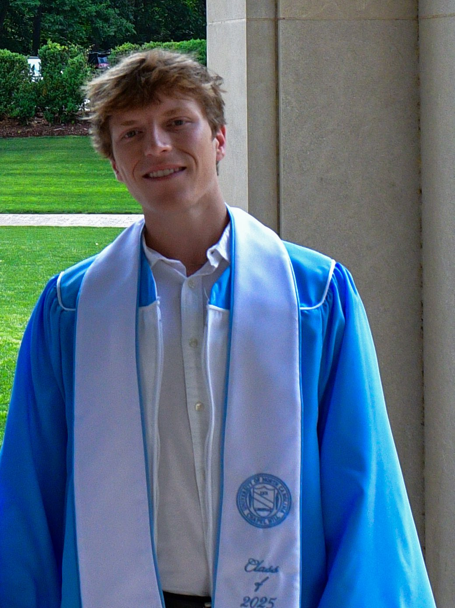
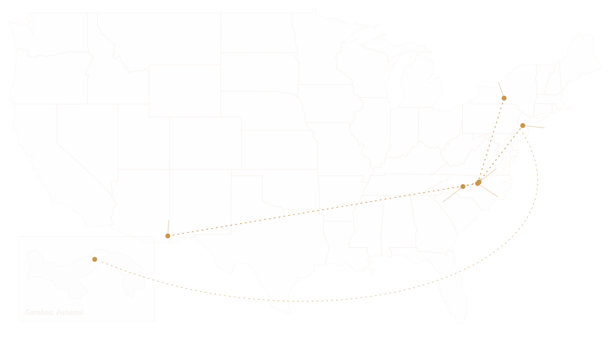

::: {.full-bleed}
<section class="section section--purple halftone" style="padding-top:clamp(5rem,11vh,7rem); padding-bottom:clamp(3rem,7vh,5rem)">
<div class="inner reveal">

```{=html}
<h1 class="visually-hidden">About</h1>
<div class="about-head">

<div>
<p class="eyebrow">About</p>
<p class="lead">I'm a PhD student in Ecology &amp; Evolutionary Biology in the <a class="klink" href="https://socialbat.org/">Carter Lab</a>, where I study how cooperative social relationships form and persist, using vampire bats as a window into a question that spans the social animal kingdom. I didn't always know this is what I wanted to do though! Scroll down to see my journey.</p>
</div>
</div>
```
</div>
</section>
:::

::: {.full-bleed}
<section class="section section--black">
<div class="inner reveal">

```{=html}
<p class="eyebrow">Where I've worked so far</p>
<p class="muted" style="margin:0 0 1.6rem">Click a number for the story.</p>
<div class="jmap">

<button class="jbadge" style="left:71.3%; top:61.3%" data-stop="salisbury" aria-label="Salisbury">1</button>
<button class="jbadge" style="left:82.5%; top:48.1%" data-stop="ncssm" aria-label="NCSSM">2</button>
<button class="jbadge" style="left:82.9%; top:59.4%" data-stop="unc" aria-label="UNC Chapel Hill">3</button>
<button class="jbadge" style="left:27.7%; top:63.0%" data-stop="swrs" aria-label="Southwestern Research Station">4</button>
<button class="jbadge" style="left:81.4%; top:22.5%" data-stop="cornell" aria-label="Cornell">5</button>
<button class="jbadge" style="left:22.3%; top:73.5%" data-stop="gamboa" aria-label="Gamboa, Panamá">6</button>
<button class="jbadge" style="left:90.7%; top:37.9%" data-stop="princeton" aria-label="Princeton">7</button>
</div>
<div class="jtabs" role="tablist" aria-label="Places I've worked">
<button class="jtab on" data-stop="salisbury">1 · Salisbury</button>
<button class="jtab" data-stop="ncssm">2 · NCSSM</button>
<button class="jtab" data-stop="unc">3 · UNC</button>
<button class="jtab" data-stop="swrs">4 · SWRS</button>
<button class="jtab" data-stop="cornell">5 · Cornell</button>
<button class="jtab" data-stop="gamboa">6 · Gamboa</button>
<button class="jtab" data-stop="princeton">7 · Princeton</button>
</div>
<div class="jpanels">
<div class="jpanel on" data-stop="salisbury">
<h3>Salisbury, North Carolina <span>· hometown</span></h3>
<p>I grew up here, in a small town where science wasn't especially trusted or encouraged. I found my way in anyway.</p>
</div>
<div class="jpanel" data-stop="ncssm">
<h3>NC School of Science &amp; Mathematics, Durham <span>· high school</span></h3>
<p>NCSSM got me out of Salisbury, and mentorship there put me in a real research lab before I had finished high school. That first taste of science and real data was the thing that stuck.</p>
</div>
<div class="jpanel" data-stop="unc">
<h3>UNC Chapel Hill <span>· B.S. Biology, 2021–2025</span></h3>
<p>Four years in <a class="klink" href="https://pfenniglab.web.unc.edu/">Karin Pfennig's</a> lab working on behavioral variation and hybridization in spadefoot toads. It was where I learned how to do independent research. The exploratory-behavior assays I set up are still used in the lab. I earned Highest Honors and the Robert Coker Award during my time there.</p>
</div>
<div class="jpanel" data-stop="swrs">
<h3>Southwestern Research Station, Arizona <span>· undergrad field seasons</span></h3>
<p>Fieldwork for the spadefoot project, comparing exploratory and hybridization behaviors across populations from Arizona to Kansas, based out of <a class="klink" href="https://www.amnh.org/research/southwestern-research-station">SWRS</a> in the Chiricahua Mountains. The sky-island canyons are also where much of my <a class="klink" href="photography.html">photography</a> comes from.</p>
</div>
<div class="jpanel" data-stop="cornell">
<h3>Cornell University <span>· summer 2024</span></h3>
<p>A summer with the <a class="klink" href="https://sheehanlab.weebly.com/">Sheehan Lab</a> studying territory and anxiety-related behavior in rewilded laboratory mice, with <a class="klink" href="https://matthewzipple.weebly.com/">Dr. Matthew Zipple</a>. This is where my passion for social behaviors developed, and also where I was involved in one of my <a class="klink" href="https://www.cell.com/current-biology/abstract/S0960-9822(25)01397-1">first papers</a>!</p>
</div>
<div class="jpanel" data-stop="gamboa">
<h3>Gamboa, Panamá <span>· the second colony</span></h3>
<p>One of our two vampire-bat colonies lives in Gamboa. Our lab goes there to collect and study vampire bats at larger scales. The colonies here are studied simultaneously with the ones in Princeton so we can compare our findings.</p>
</div>
<div class="jpanel" data-stop="princeton">
<h3>Princeton University <span>· PhD, 2025–present</span></h3>
<p>Now. Ecology &amp; Evolutionary Biology in the Carter Lab: one colony here (soon two), defection experiments, social-relations models, and a computer-vision pipeline in progress.</p>
</div>
</div>
<script>
(function () {
  var root = document.currentScript.closest('.inner');
  function activate(stop) {
    root.querySelectorAll('.jtab, .jbadge, .jpanel').forEach(function (el) {
      el.classList.toggle('on', el.getAttribute('data-stop') === stop);
    });
  }
  root.addEventListener('click', function (e) {
    var b = e.target.closest('.jtab, .jbadge');
    if (b) activate(b.getAttribute('data-stop'));
  });
  activate('salisbury');
})();
</script>
```
</div>
</section>
:::

::: {.full-bleed}
<section class="section section--panel section-divider">
<div class="inner page-prose reveal">
<h2 class="h-md">How I work</h2>
<p class="muted" style="margin-top:1rem">I split my time between three modes:</p>

- hands-on behavioral experiments with captive colonies of vampire bats
- statistical modeling in R (Bayesian social-network models, mostly via <a class="klink" href="https://besjournals.onlinelibrary.wiley.com/doi/10.1111/1365-2656.14021">STRAND</a>)
- building tools like a machine-learning pipeline to identify individual bats from video, letting us collect behavior at a scale hand-scoring can't reach

<h2 class="h-md" style="margin-top:2.6rem">Beyond the science</h2>
<p class="muted">I care a lot about who gets to do science. As a first-generation bachelors and PhD student, and an openly gay researcher from a community that was underserved by science outreach, I try to build the kind of inclusive, welcoming spaces I once needed. When I'm not with the bats, I'm often behind a camera. I started doing wildlife photography while out in the field in Arizona: I figured since I was lucky enough to be surrounded by these animals I should also take pictures to showcase them to others!</p>

<div class="btn-row">
<a class="btnx btnx--solid" href="research.html">See the research</a>
<a class="btnx" href="cv.html">View CV</a>
</div>
</div>
</section>
:::
