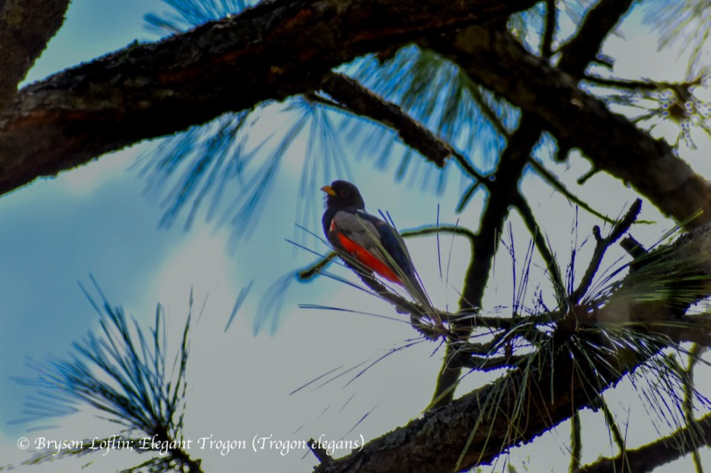
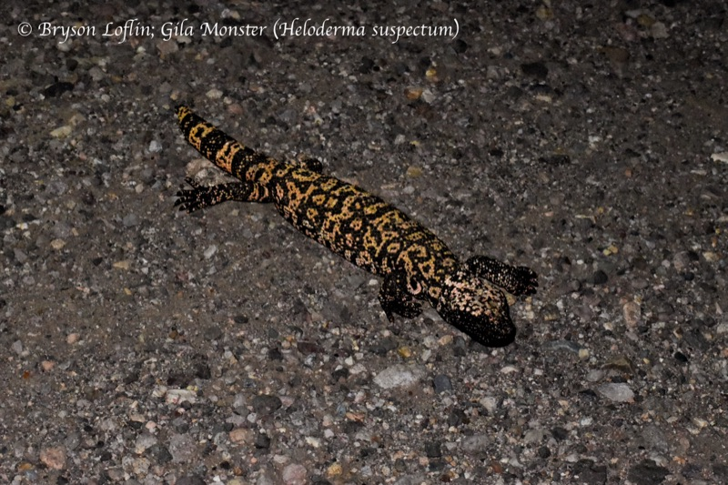
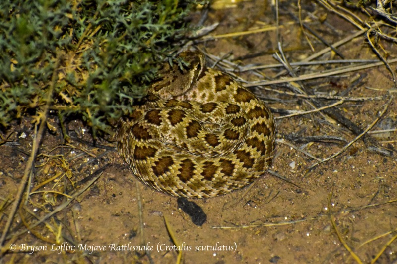
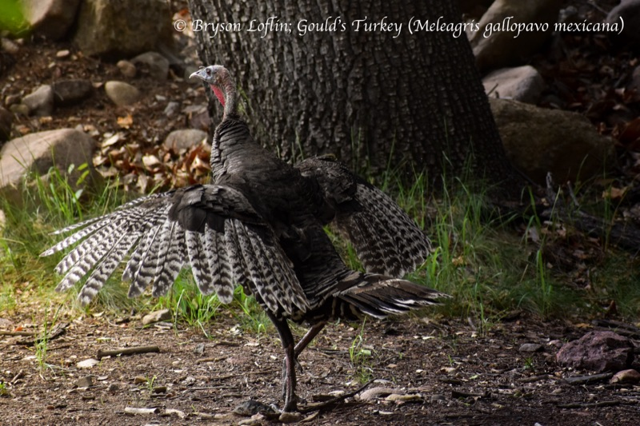

::: {.full-bleed}
<header class="hero hero--net">
<div id="hero-net" class="hero-net-bg" aria-hidden="true"></div>
<div class="hero__solo">
<div class="hero__copy reveal">
<p class="eyebrow">Ecology &amp; Evolutionary Biology · Princeton University</p>
<h1>What are the causes and consequences of cooperation?</h1>
<p class="lead">I'm studying that question in vampire bats, who rely on <span class="blood-em">cooperative friendships</span> to survive. I can manipulate these friendships in the lab to understand how they form and fall apart.</p>
```{=html}
<div class="hero-links">
<a href="research.html">Current projects</a>
<a href="publications.html">Papers &amp; preprints</a>
<a href="cv.html">CV</a>
<a href="play.html">Play!</a>
</div>
```
</div>
</div>
<p class="hero__cap">an example of a colony network — who gives, who receives, who's connected</p>
</header>
:::

::: {.full-bleed}
<section class="section section--purple halftone">
<div class="inner">
<div class="reveal">
<p class="eyebrow">The question</p>
<p class="h-lg measure">Why would an animal give up food to help another?</p>
<p class="lead measure" style="margin-top:1.6rem">Often when people imagine natural selection, they think "Survival of the fittest, every organism for themself." Why would a bat literally regurgitate its hard-earned meal to someone else then? It clearly isn't so simple. That's exactly what my research tries to understand. We know they prioritize helping "good" bats who help them back. But what if a long-term friend suddenly stops helping? What if you need that partner for the colony to survive? We don't understand if and how the bats weigh these options, but I have four years to find out! Understanding cooperative relationships is not simple, so I am currently working on multiple projects to understand all of the layers to this complex problem.</p>
<h2 class="h-md" style="margin-top:3rem">Current research</h2>
</div>
<div class="rlist reveal">
<div class="ritem">
<div class="ritem__num">01</div>
<div class="ritem__body">
<h3>Colony level social relations models</h3>
<p>Fitting a <a class="klink" href="https://besjournals.onlinelibrary.wiley.com/doi/10.1111/1365-2656.14021">STRAND social-relations model</a> across all of our long-term data, separating reciprocity, kinship, and individual generosity in grooming and food sharing, and watching how bonds change over time.</p>
<div class="ritem__tags"><span class="tag">Bayesian networks</span><span class="tag">STRAND</span><span class="tag">Reciprocity</span></div>
</div>
<div class="ritem__meta">Ongoing</div>
</div>
<div class="ritem">
<div class="ritem__num">02</div>
<div class="ritem__body">
<h3>Automatic bat ID with machine learning</h3>
<p>Building a computer-vision pipeline to re-identify individual bats from video, testing whether 21 individuals are visually separable on held-out days, so we can study behavior without hand labelling days of footage.</p>
<div class="ritem__tags"><span class="tag">Computer vision</span><span class="tag">Re-ID</span><span class="tag">Automation</span></div>
</div>
<div class="ritem__meta">Ongoing</div>
</div>
<div class="ritem">
<div class="ritem__num">03</div>
<div class="ritem__body">
<h3>Defection &amp; partner choice</h3>
<p>Experimentally manipulating whether a new bat in the colony is helpful or defective, then measuring how bats differentially invest in them: a direct causal test of reciprocity and partner-choice.</p>
<div class="ritem__tags"><span class="tag">Captive experiment</span><span class="tag">Partner choice</span></div>
</div>
<div class="ritem__meta">Ongoing</div>
</div>
<div class="ritem">
<div class="ritem__num">04</div>
<div class="ritem__body">
<h3>Defection &amp; interdependence</h3>
<p>How does response to defection change when bats are also siblings? Or what if they have been long term friends? Or what if the defective bat is their only option? These are all examples of what we might label as "interdependence", and we want to understand how bats respond to defection differently in these scenarios.</p>
<div class="ritem__tags"><span class="tag">Kinship</span><span class="tag">Interdependence</span><span class="tag">Captive experiment</span></div>
</div>
<div class="ritem__meta">Ongoing</div>
</div>
</div>
<div class="reveal center" style="margin-top:3.2rem">
<p class="lead" style="margin:0">Interested in my story and journey to science?</p>
<div class="btn-row" style="justify-content:center; margin-top:1.2rem"><a class="btnx btnx--solid" href="about.html">Check it out here</a></div>
</div>
</div>
</section>
:::

::: {.full-bleed}
<section class="section section--purple halftone halftone--r">
<div class="inner">
<div class="reveal" style="display:flex; justify-content:space-between; align-items:flex-end; flex-wrap:wrap; gap:1rem">
<div>
<p class="eyebrow">Photography</p>
<p class="h-lg" style="margin:0">The wildlife I meet along the way.</p>
</div>
<a class="btnx" href="photography.html">Full gallery</a>
</div>
```{=html}
<div class="home-strip reveal">
<a href="photography.html" class="hs"><span>Elegant Trogon</span></a>
<a href="photography.html" class="hs"><span>Gila Monster</span></a>
<a href="photography.html" class="hs"><span>Mojave Rattlesnake</span></a>
<a href="photography.html" class="hs"><span>Gould's Turkey</span></a>
</div>
```
</div>
</section>
:::

::: {.full-bleed}
<section class="section section--black section-divider">
<div class="inner center reveal">
<p class="h-lg" style="max-width:24ch; margin:0 auto">Let's talk cooperation, bats, or photography!</p>
<p class="muted" style="margin-top:.9rem">I reply to email within two days. Usually one.</p>
<div class="btn-row" style="justify-content:center">
<a class="btnx btnx--solid" href="mailto:bryson.loflin@princeton.edu">Email me</a>
<a class="btnx" href="contact.html">All contacts</a>
</div>
</div>
</section>
:::
