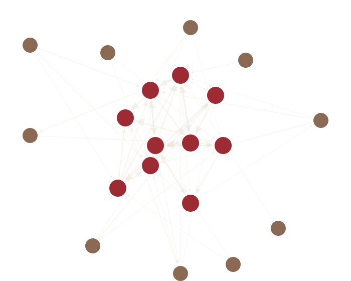

::: {.full-bleed}
<header class="hero hero--net hero--short hero--centered">

Research

<h1>How cooperative relationships form, persist, and fall apart.</h1>

Broadly, I study the causes and consequences of cooperative social behavior. Vampire bats are my study system because they let me do something rare: manipulate cooperation experimentally and watch relationships change in response.

My questions center on <strong>reciprocity</strong>, <strong>fitness interdependence</strong> (kinship and group size), <strong>partner investment strategies</strong>, and the <strong>social-network structure</strong> of a colony over time.

</header>
:::

::: {.full-bleed}
<section class="section section--black">

<h2 class="h-lg">Ongoing projects</h2>

01

<h3>Colony level social relations models</h3>

Fitting a <a class="klink" href="https://besjournals.onlinelibrary.wiley.com/doi/10.1111/1365-2656.14021">STRAND social-relations model</a> across all of our long-term data, separating reciprocity, kinship, and individual generosity in grooming and food sharing, and watching how bonds change over time.

STRANDBayesian networksReciprocityR / Stan

A colony as a directed network — who gives to whom, and how much. Modelled with <a class="klink" href="https://besjournals.onlinelibrary.wiley.com/doi/10.1111/1365-2656.14021">STRAND (Ross, McElreath &amp; Redhead 2024)</a>.

Ongoing Analysis

02

<h3>Automatic bat ID with machine learning</h3>

Building a computer-vision pipeline to re-identify individual bats from video, testing whether 21 individuals are visually separable on held-out days, so we can study behavior without hand labelling days of footage.

Computer visionRe-identificationPythonAutomation

<video src="assets/video/bat-reid.mp4" muted loop autoplay playsinline preload="metadata" style="width:100%; height:auto; display:block"></video>

Ongoing Method dev

03

<h3>Defection &amp; partner choice</h3>

Experimentally manipulating whether a new bat in the colony is helpful or defective, then measuring how bats differentially invest in them: a direct causal test of reciprocity and partner-choice.

Captive experimentPartner choiceFasting trials

<i class="dyad-dot dyad-dot--groom"></i>Grooming
<i class="dyad-dot dyad-dot--share"></i>Food shared
<i class="dyad-dot dyad-dot--bond"></i>Bond strength

Two strangers join the colony

Ongoing

04

<h3>Defection &amp; interdependence</h3>

How does response to defection change when bats are also siblings? Or what if they have been long term friends? Or what if the defective bat is their only option? These are all examples of what we might label as "interdependence", and we want to understand how bats respond to defection differently in these scenarios. The prediction, animated below: after the same defection, an <strong>unrelated</strong> bat withdraws its investment, while between <strong>kin</strong> interdependence buffers the response and the focal bat keeps giving.

KinshipInterdependenceCaptive experiment

<i class="dyad-dot dyad-dot--share"></i>Food shared
<i class="dyad-dot dyad-dot--defect"></i>Defection
<i class="dyad-dot dyad-dot--bond"></i>Bond strength

<figure class="dyad">

Unrelated pair

Reciprocal food sharing

</figure>
<figure class="dyad">

Kin pair &middot; siblings

Reciprocal food sharing

</figure>

Ongoing

</section>
:::

::: {.full-bleed}
<section class="section section--black">

From the field to the lab

The bats I study are wild-caught or donated from zoos. The science happens in the lab.

I work with captive colonies of vampire bats: running fasting trials, tracking who shares food with whom, and testing what makes a cooperative bond form and hold. Once the animals are with us, the lab is where they stay. We make sure they are happy and engaged in their new home though! They are well cared for, and often are in better condition than those in the field.

We don't release vampire bats back to the wild, so the colony has to be a place where bats can live, roost, and socialize naturally enough that the cooperation I measure is the real thing. Good husbandry isn't a side task: it's the foundation the entire research program stands on.

</section>
:::

::: {.full-bleed}
<section class="section section--black section-divider">

Context

<h3>Study system</h3>

Common vampire bats (<em>Desmodus rotundus</em>), studied in captive colonies (animals that are wild-caught or donated from zoos).

<h3>Methods</h3>

Bayesian social-relations models (STRAND / Stan), longitudinal network analysis in R, RFID tracking, machine-learning re-ID, and manipulative fasting-trial experiments.

<h3>People &amp; support</h3>

Advised by Dr. Gerry Carter (<a class="klink" href="https://socialbat.org/">Carter Lab</a>), studying cooperation in captive colonies of vampire bats. Earlier training with the <a class="klink" href="https://pfenniglab.web.unc.edu/">Pfennig Lab</a> (UNC) and <a class="klink" href="https://sheehanlab.weebly.com/">Sheehan Lab</a> (Cornell).

</section>
:::

::: {.full-bleed}
<section class="section section--panel section-divider">

Five quick answers

<h2 class="h-md" style="margin-bottom:1.8rem">The questions I actually get asked</h2>

Do vampire bats really share blood?

Yes. A bat that fed regurgitates part of its meal to a roost-mate that didn't, and it's often not a relative. It's one of the clearest cases of reciprocal cooperation in any animal: bats keep track of who has helped them and preferentially help those partners back (<a class="klink" href="https://doi.org/10.1038/308181a0">Wilkinson 1984</a>, <a class="klink" href="https://doi.org/10.1098/rspb.2012.2573">Carter &amp; Wilkinson 2013</a>). That bookkeeping is what my research is about.

Will a vampire bat attack me?

No. Common vampire bats mostly feed on sleeping livestock, take about a tablespoon of blood, and the animal usually never notices. They're shy, only weigh ~40&nbsp;g, and far more interested in cow blood than mine!

How do you tell individual bats apart in the dark?

Three ways: tiny RFID tags logged at feeders, forearm bands readable on infrared video, and (the part I'm actively building) computer-vision models that learn to re-identify individuals and score their interactions automatically.

Are the odds in <a class="klink" href="play.html">the game</a> real?

Every probability is taken from published field and lab studies: Wilkinson's classic starvation and food-sharing data, reciprocity experiments from the Carter Lab, Bshary's cleaner-fish work, Ratnieks's worker-policing counts. Sources and simplifications are listed under "model notes" on the <a class="klink" href="play.html">Play page</a> and on each game's science page: <a class="klink" href="learn-bat.html">vampire bat</a>, <a class="klink" href="learn-fish.html">cleaner fish</a>, <a class="klink" href="learn-bee.html">honeybee</a>.

Can you give a talk, or can I collaborate?

Probably, I love outreach! If you or anyone you know is interested in hearing about vampire bat friendships I'm happy to talk all day about it. <a class="klink" href="mailto:bryson.loflin@princeton.edu">Email me</a>, I will reply within two days.

<a class="btnx btnx--solid" href="publications.html">Publications</a><a class="btnx" href="play.html">Feel the dilemma, play the game</a>

</section>
:::
